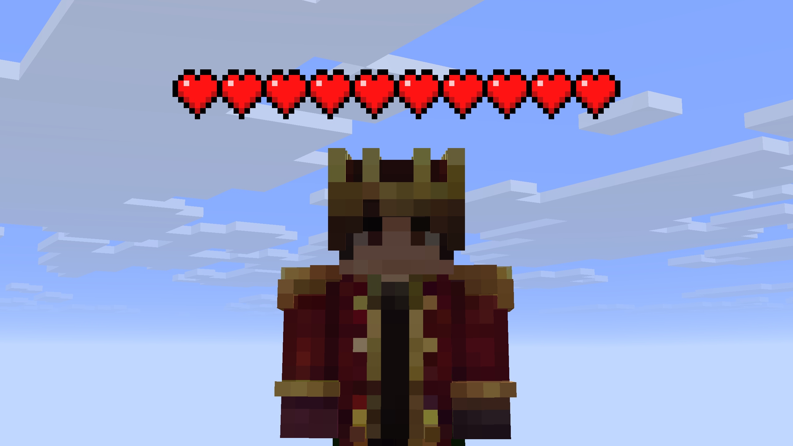

<div align="center">


# HeartsPlus

**See every player's health — as vanilla hearts floating above their heads.**

### [Download on Modrinth](https://modrinth.com/mod/heartsplus)

[](https://modrinth.com/mod/heartsplus)
[](https://github.com/serechka/HeartsPlus/actions/workflows/build.yml)
[](LICENSE)

A lightweight, fully configurable client-side mod for Minecraft.<br/>
Fabric and NeoForge for **26.1 – 26.3**, plus Fabric and NeoForge builds for **1.21.11**.<br/>
Works in survival, PvP, minigames — anywhere knowing your ally's HP matters.

</div>

---

## Features

- **Vanilla-style hearts** above every player — containers, halves and absorption hearts, exactly like your own HUD
- **Damage blink** — hearts flash after damage with the vanilla HUD animation, including the pre-drop highlight (toggleable)
- **Status variants** — poisoned, withered and frozen hearts, chosen with the same priority as the vanilla HUD
- **Smart stacking** — long health bars wrap into rows of 10 and grow upward, never covering nametags
- **Texture source toggle** — take hearts from your active resource pack, or pull them from Minecraft's built-in default pack
- **In-game config screen** — integrates with Mod Menu on Fabric, or open it with a keybind
- **11 languages** — English, Русский, Українська, 中文, Español, Português (BR), Deutsch, Français, 日本語, 한국어, Italiano
- **Angle-independent shading** — hearts stay perfectly readable from above or below
- **Featherweight** — no dependencies beyond Fabric API (Fabric builds), no overhead when no one is around

## Screenshot



## Installation

Get the jar from [Modrinth](https://modrinth.com/mod/heartsplus) — GitHub
releases link straight to the Modrinth download pages.

1. Pick the build matching your loader and Minecraft version
2. Drop **HeartsPlus** into your `mods/` folder (Fabric builds also need [Fabric API](https://modrinth.com/mod/fabric-api))
3. *(Optional, Fabric)* Add [Mod Menu](https://modrinth.com/mod/modmenu) for the settings screen entry
4. Join a world — hearts appear above other players instantly

> **Multiplayer note:** HeartsPlus is client-side only. Health data comes from what the server
> already syncs about visible players, so it works on vanilla servers without any server mod.

## Configuration

Open **Mod Menu → HeartsPlus → Settings** on Fabric, or press **H** anywhere
(no menu needed on NeoForge).

| Option | Default | Description |
|---|:---:|---|
| Show Hearts | ON | Master toggle for the whole mod |
| Show Above Yourself | OFF | Draw hearts above your own player (visible in F5 / freecam) |
| Show Invisible Players | OFF | Off = no hearts on invisible players; on = hearts only while they wear armour |
| Show Behind Blocks | ON | Off = walls hide the hearts; on = a dimmed see-through copy stays visible through them, like a name tag |
| Animation | ON | Damage-blink flash above a player after they take damage |
| Heart Textures | Current | Vanilla = built-in look, Current = your active resource pack |
| Scale | 1.0 | Heart size, ×0.25 – ×4 |
| Render Distance | 128 | Maximum distance in blocks, 8 – 128 |
| Height Offset | 0 | Fine-tune the height above the head, −20 – +40 |

Settings persist to `config/heartsplus.json` and apply instantly.

**Keybinds** (Controls → HeartsPlus):

| Key | Default | Action |
|---|:---:|---|
| Toggle Health Indicators | *unbound* | Quick on/off with an action-bar confirmation |
| Open HeartsPlus Settings | **H** | Open the config screen |

## Building from source

Requires **JDK 25** (e.g. [Temurin](https://adoptium.net/)):

```bash
./gradlew build    # on the branch of the era you want to build
```

The mod jar appears in `build/libs/`. CI builds every push; pushing a `v*` tag
creates a GitHub release linking to the Modrinth downloads.

For a quick in-game check, `./gradlew runClient` boots a dev client straight
into a test world (create a world named `New World` once if your dev
environment doesn't have it yet). In a solo world your own hearts are hidden
by default (like vanilla name tags) — press **H**, enable **Show on Self**,
then **F5** to see them above your head.

<details>
<summary>Supported versions and branches</summary>

One branch per rendering era — each branch ships one jar covering its
whole range, on both loaders:

| Branch | Loader | Game versions |
|---|---|---|
| `main` | Fabric | 26.1 – 26.3 |
| `neoforge` | NeoForge | 26.1 – 26.3 |
| `1.21` | Fabric | 1.21.11 |
| `neoforge-1.21` | NeoForge | 1.21.11 |
| `1.21.9` | Fabric | 1.21.9 – 1.21.10 |
| `neoforge-1.21.9` | NeoForge | 1.21.9 – 1.21.10 |
| `1.21.6` | Fabric | 1.21.6 – 1.21.8 |
| `neoforge-1.21.6` | NeoForge | 1.21.6 – 1.21.8 |
| `1.21.2` | Fabric | 1.21.2 – 1.21.3 |
| `neoforge-1.21.2` | NeoForge | 1.21.2 – 1.21.3 |
| `1.21.4` | Fabric | 1.21.4 – 1.21.5 |
| `neoforge-1.21.4` | NeoForge | 1.21.4 – 1.21.5 |
| `1.21.0` | Fabric | 1.21 – 1.21.1 |
| `neoforge-1.21.0` | NeoForge | 1.21 – 1.21.1 |

Forge is not planned (replaced by NeoForge for 1.21+) — each Minecraft
rendering era needs its own port.

</details>

## Credits

- Default-texture mode loads its heart sprites straight from Minecraft's own default resource pack.

## License

[MIT](LICENSE) — free to use, modify and redistribute.
