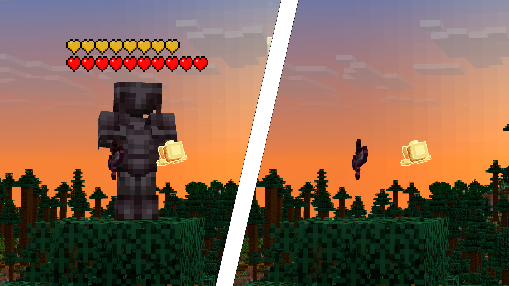

<div align="center">


# HeartsPlus

Vanilla-style health hearts above every player's head.

### [Download on Modrinth](https://modrinth.com/mod/heartsplus)

[](https://modrinth.com/mod/heartsplus)
[](https://github.com/serechka/HeartsPlus/actions/workflows/build.yml)
[](LICENSE)

Client-side. Fabric and NeoForge, Minecraft **1.21 - 26.3**.

</div>


## Features

- Vanilla hearts above every player: containers, halves, absorption, poisoned, withered and frozen
- Damage flash and heal pop with vanilla HUD timing
- Hearts sit above the name tag and follow it in every pose
- Adjustable opacity for hearts behind walls
- Texture source: built-in vanilla sprites or the active resource pack
- Settings on [Cloth Config](https://modrinth.com/mod/cloth-config), 11 languages
- Render distance up to 2048 blocks; when off or with nobody around, the mod does nothing

> Invisible players show health only while wearing armour, and never through walls. May be against the rules on some servers.



## Versions and branches

One branch per rendering era - each branch ships one jar covering its whole
range, on both loaders:

| Branch | Loader | Game versions |
|---|---|---|
| `main` | Fabric | 26.1 - 26.3 |
| `neoforge` | NeoForge | 26.1 - 26.3 |
| `1.21` | Fabric | 1.21.11 |
| `neoforge-1.21` | NeoForge | 1.21.11 |
| `1.21.9` | Fabric | 1.21.9 - 1.21.10 |
| `neoforge-1.21.9` | NeoForge | 1.21.9 - 1.21.10 |
| `1.21.6` | Fabric | 1.21.6 - 1.21.8 |
| `neoforge-1.21.6` | NeoForge | 1.21.6 - 1.21.8 |
| `1.21.4` | Fabric | 1.21.4 - 1.21.5 |
| `neoforge-1.21.4` | NeoForge | 1.21.4 - 1.21.5 |
| `1.21.2` | Fabric | 1.21.2 - 1.21.3 |
| `neoforge-1.21.2` | NeoForge | 1.21.2 - 1.21.3 |
| `1.21.0` | Fabric | 1.21 - 1.21.1 |
| `neoforge-1.21.0` | NeoForge | 1.21 - 1.21.1 |

Forge is not planned - each rendering era needs its own port.

## Install

1. Install [Cloth Config API](https://modrinth.com/mod/cloth-config) for your game version
2. Download the HeartsPlus file for your loader and game version from [Modrinth](https://modrinth.com/mod/heartsplus)
3. Fabric builds also need [Fabric API](https://modrinth.com/mod/fabric-api); [Mod Menu](https://modrinth.com/mod/modmenu) adds a settings entry. NeoForge needs nothing else
4. Put the jars into `mods/`

> **Multiplayer note:** HeartsPlus is client-side only. Health data comes from what the server
> already syncs about visible players, so it works on vanilla servers without any server mod.

## Configuration

Press **H** (or Mod Menu on Fabric). Three tabs:

| Tab | Settings |
|---|---|
| **Behavior** | show hearts, show on self, show invisible, animation, render distance |
| **Appearance** | texture source, scale, see-through opacity |
| **Position** | height per pose (standing, sneaking, swimming, flight), follow smoothing |

Settings persist to `config/heartsplus.json` and apply instantly.
The toggle keybind is unbound by default; **H** opens settings.

## Building from source

Requires JDK 25 (e.g. [Temurin](https://adoptium.net/)):

```bash
./gradlew build    # on the branch of the era you want to build
```

`./gradlew runClient` boots a dev client into a test world. In a solo world your
own hearts are hidden by default - press **H**, enable **Show on Self**, then **F5**.

## License

[MIT](LICENSE) - free to use, modify and redistribute.
